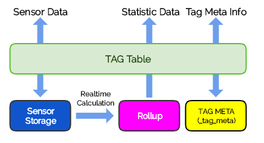

## Concept



The TAG table is responsible for data storage and related additional information management for sensor data processing.

The TAG table provides three conceptual data processing spaces as described below.

#### Data Table

This is an internal sensor data table based on the schema defined by the user when TAG table is created.

This data can be extracted through a SELECT query on the TAG table.

This table has very strong data management capabilities as listed below.

1. Tens of thousands to Hundreds of thousands of sensor data can be loaded at high speed.
2. Tens of thousands of sensor data can be retrieved at high speed given the time range condition.
3. Real-time compression allows long-term storage of sensor data.
4. Chronological deletion of sensor data beginning with the oldest is possible.

The user sensor data to be stored is, in basic, a time series data and is a specific data type with the corresponding tag of the name, time, and 64-bit real value.

```
+-------------------------------------------------------------------------------------------+
| tagname (user defined) | time (64-bit) | value (64-bit) | (user defined extended columns) |
+-------------------------------------------------------------------------------------------+
```

#### ROLLUP Table

This is an internal table that automatically generates statistical data based on the sensor data stored in the sensor storage.

This was developed in order to obtain statistical data over a long period of time within a few seconds in real time analysis.

Basically, three internal rollup tables are created (per hour, minute, and second) for one data table, and a user-defined rollup can be created through the CREATE ROLLUP statement. 

Rollup tables provide 6 types of statistical data: MIN, MAX, AVG, SUM, COUNT, SUMSQ.

You can retrieve the statistical data from the rollup tables via using ROLLUP queries on the tag tables.

#### Meta Table

This is another table that stores the name and additional meta information for TAG data.

Users can generate this meta information with the INSERT clause and manipulate it in several ways through SELECT, UPDATE, and DELETE

#### Duplicate Removal

This is a function that automatically removes duplicated data.

If the TAG name and time of newly inserted data matches those of existing data within a predefined duration (with a maxmum duration of 30 days) those redundant data will be automatically deleted.
